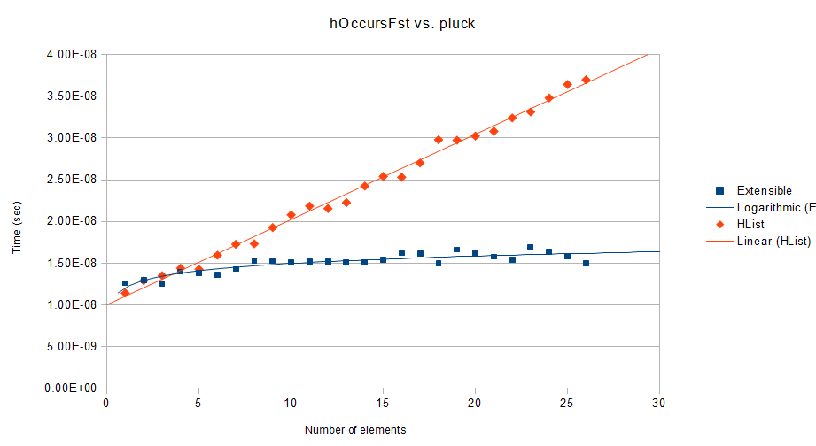

extensible
======================

This package provides extensible poly-kinded data types, including records and polymorphic open unions.

It focuses on being neat and fast.

Bug reports and contributions are welcome!
